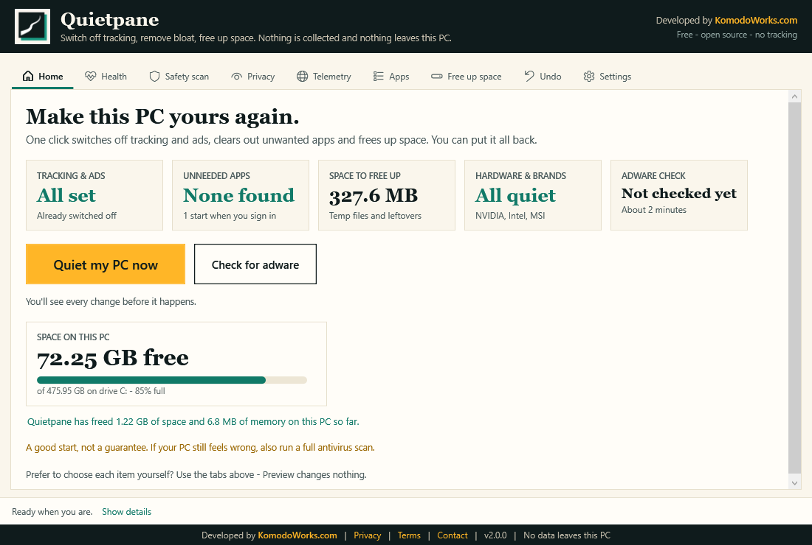
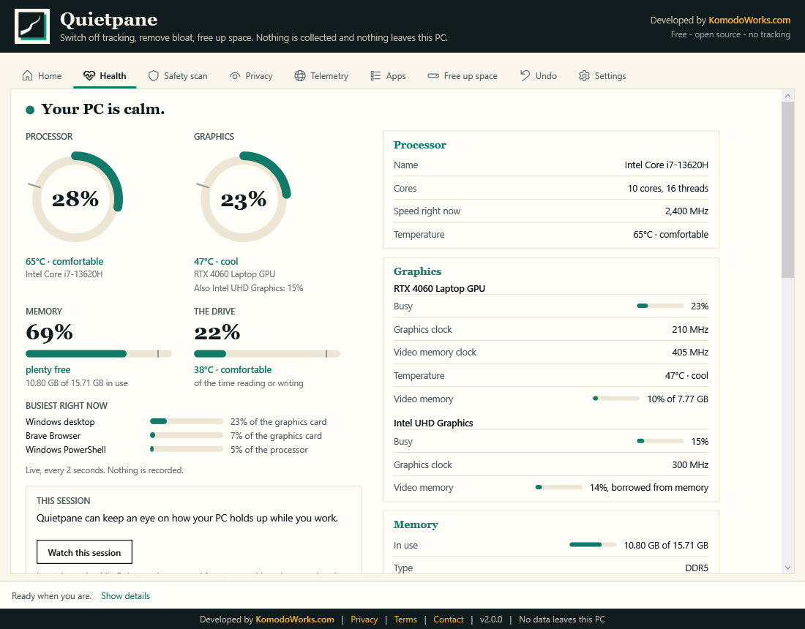
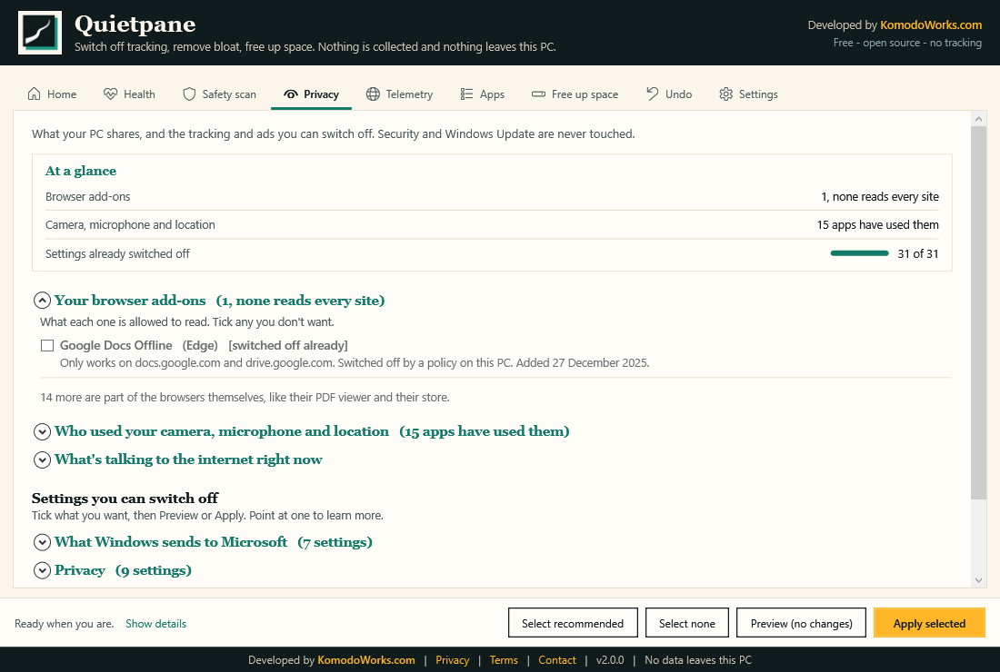
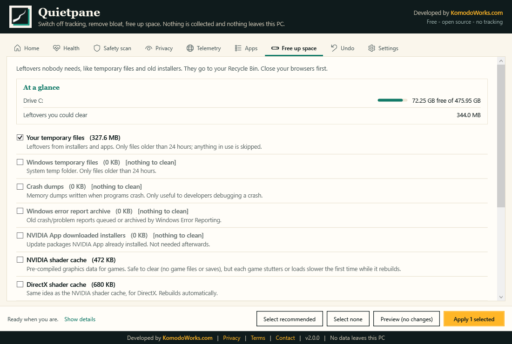

<p align="center">
  <a href="https://www.komodoworks.com"></a>
</p>

<h1 align="center">Quietpane</h1>

<p align="center">
  <b>See what your PC is telling on you, and switch it off.</b><br>
  Every browser add-on and what it is allowed to read. Which apps used your camera and microphone, and when. What is talking to the internet right now. Then the tracking, the bloat and the wasted space.<br>
  Everything happens on your PC, and nothing leaves it.<br><br>
  Developed by <a href="https://www.komodoworks.com"><b>KomodoWorks.com</b></a> &middot; Free &amp; open source (MIT) &middot; Windows 10 / 11
</p>

<p align="center">
  <a href="https://github.com/kgntmr/quietpane/releases/latest/download/Quietpane.zip"><b>⬇&nbsp;&nbsp;Download Quietpane</b></a> &nbsp;(one small ZIP file)
</p>

<p align="center">
  <sub><b>No <code>.exe</code>, no installer, no compiled anything.</b> Quietpane is plain-text PowerShell, so you can read every line before you run it - and you should, with anything that asks for administrator rights. <a href="#verify-it-yourself">How to check it in four steps</a>.</sub>
</p>

<p align="center"></p>

## Get started

1. **[Download Quietpane](https://github.com/kgntmr/quietpane/releases/latest/download/Quietpane.zip)**.
2. **Unzip it:** right-click **Quietpane.zip** → **Extract All** → **Extract**. It can't start from inside the ZIP.
3. In the new folder, double-click **Start Quietpane**, then press **Quiet my PC now**.

It shows what it will do before doing anything, takes about a minute, and **Undo everything** puts it all back. You need Windows 10 or 11 and an administrator account. Nothing is installed.

Quietpane isn't [digitally signed](#code-signing-policy) yet, so Windows asks a few questions first:

| Windows says | Click |
|---|---|
| "Windows protected your PC" | **More info** → **Run anyway** |
| "Do you want to run this file?" | **Run** |
| "Do you want to allow this app to make changes?" | **Yes** |

**You should be suspicious of that**, and of anything else that asks for administrator rights. A signing certificate has been [applied for](#code-signing-policy); until it comes through, the honest answer is that a signature only tells you who published something, not what it does. Quietpane offers you the stronger thing instead: there is no `.exe` and nothing compiled, so you can read the whole app before running it, and [check in about a minute](#verify-it-yourself) that it makes no network connections at all.

**Want to look before you leap?** Double-click **Safety scan only**. It changes nothing on your PC - it only looks and tells you what it found.

> **A good start, not a guarantee.** Quietpane tidies up the usual troublemakers, but it can't promise a PC is clean. If yours still feels wrong, run a deeper scan with a dedicated security tool too.

## How it treats your PC

- **Collects nothing, connects to nothing.** No accounts, analytics, telemetry or ads, and no network requests at all. [Check for yourself](#verify-it-yourself).
- **Tells you first.** Every item explains what it does and its side effects, and **Preview** shows exactly what would change.
- **Can be undone.** Changes go into a restore point, and clean-up only moves files to your Recycle Bin. The three exceptions say so before you confirm: removing an app, uninstalling a brand extra, and deleting a threat for good.
- **Leaves your security alone.** Defender, SmartScreen, the firewall and Windows Update are never touched.
- **Owns up when something goes wrong.** If a part of your PC can't be read, that part says so and the rest still works. If Undo can't put something back, it says how many and keeps the restore point so you can try again. One job runs at a time, only one copy of the app opens at once, and an error never takes the window down with it.
- **Says less, means more.** Every screen is one plain line per thing, in everyday words. The detail behind it is one hover or one Tab away, and the full running commentary is always in **Show details** at the bottom. An automated test keeps the window from filling up with words again.
- **Works for everyone.** Everything can be done with a keyboard alone, with a clear outline showing where you are; every control has a name screen readers such as Narrator can say, and the status line is read out as it changes. All text meets the WCAG AA contrast standard, and the automated tests fail if a control ever loses its name or a colour gets too faint to read.
- **Hides nothing.** Plain-text PowerShell you can read, plus four short C# blocks (the graphics driver's temperature, the drive's own temperature and wear, adding up folder sizes, and making the Start-menu shortcut) and two lines that give the app its own taskbar icon and a sharp window. No installer and no `.exe`: it runs from the folder you unzip, and only copies itself to Program Files if you ask for shortcuts or to start it when you sign in.

## A look around

<table>
  <tr>
    <td width="33%" align="center">
      <a href="docs/screenshot-health.png"></a><br>
      <b>Health</b><br>
      One sentence saying how it's doing, then the working: busy, warm, memory, drive.
    </td>
    <td width="33%" align="center">
      <a href="docs/screenshot-privacy.png"></a><br>
      <b>Privacy</b><br>
      Every browser add-on and what it may read, then 32 settings to switch off.
    </td>
    <td width="33%" align="center">
      <a href="docs/screenshot-space.png"></a><br>
      <b>Free up space</b><br>
      The easy room first, then where the rest of your disk went.
    </td>
  </tr>
</table>

<sub>Real screens from a real PC. The figures under <b>Worth clearing first</b> are made-up examples, because the PC these were taken on had nothing old left to clear.</sub>

## What's inside

**Home.** Cards show what could be better, and **Quiet my PC now** applies the recommended items that aren't done yet, all in one restore point, so **Undo everything** really does undo everything. It never uninstalls a program on its own. If a Windows update switches things back on, Home says what came back and offers to switch exactly those off again - and if you like, Quietpane can check for that as you sign in and put a small badge on its taskbar icon, so you don't have to remember to look. Only things that are really on again count: a setting your PC no longer has, or a brand app you uninstalled, is never reported as "back".

**Health.** It opens with **one sentence** saying how your PC is doing - "Your PC is calm", or "Your PC is being held back to cool off" - because a screen of a dozen numbers leaves you to work out which one matters. Underneath, four tiles built to exactly the same pattern, so they can be compared at a glance rather than read one at a time: the **processor**, the **graphics card**, **memory** and **the drive**, each with its figure, a bar carrying a mark where that reading stops being ordinary, a temperature in plain words, and **the last two minutes** drawn beneath it so a spike that has already passed is still there to see. Then one list of the **busiest programs**, merged across the processor and the graphics card, instead of the same few names repeated under every tile.

Memory shows both what the chips are holding and **how much Windows has promised** to programs - the figure that fills up first and explains a PC crawling with half its memory apparently free. The drive's temperature and its wear come **from the drive itself**, not from Windows: many storage drivers report a temperature that never moves (60 C at three in the morning and under a heavy copy alike), no wear, and no hours. Asked directly, the same drive gives a temperature that rises and falls with what it is doing, the real share of its writing life that is gone, how long it has been switched on and how much has been written to it. On a laptop the battery card adds the watts the cell itself reports and how long that leaves - worked out from the charge and the measured draw, because Windows' own estimate is a made-up number while you're on mains.

**Watch this session.** One button keeps that same reading going while you work, minimised and all, and tells you afterwards how your PC held up: the peaks rather than averages, the minutes it spent hot or held back to cool off, how far memory got, and what was busiest at the time. It draws as a **timeline**: one column per slice of time, growing taller and darker as the PC got hotter, with a second row underneath marking every spell the processor was held back to cool off. Each column takes **the worst** of what it covers, never the average, because an average hides the very moment worth seeing. If the PC sleeps, that stretch is simply empty - a gap is drawn as a gap, never stretched over. The colours are one hue in steps and the height says the same thing again, so it reads without colour vision, and every step is named in words in the legend. It watches **only while Quietpane is open and only after you press it** - nothing is installed, nothing is scheduled, nothing is written down, and closing the window forgets it. Unless you press **Save it to my Desktop**, which writes the session up as one page you can keep, open without Quietpane, or send to whoever is asking why the PC is slow: the peaks, what it spoke up about and when, where the time went, and what was busiest. Like the scan report it runs no scripts and fetches nothing from the internet.

While it watches, it speaks up about the handful of things worth interrupting for: very hot or held back for more than five minutes, memory promised past 90%, the drive down to its last tenth, or a battery with twenty minutes left. **Each is said once**, on the status line and on the taskbar icon while the window is out of sight - an alert that repeats is an alert people learn to ignore. It says what is happening, never what you ought to do about it, because it can't know whether the game you're playing is worth the heat.

**How it has been holding up.** Windows keeps its own record of how steady your PC has been - the one behind Reliability Monitor, which almost nobody opens. Quietpane shows the score out of ten with the date Windows worked it out, what stopped working in the last 30 days and which program most often, how many times the PC stopped without warning, and how long it has been awake. Windows Update and installer entries are left out, because an update that installed is not a problem. Where Windows has kept no score, the card says so instead of showing a zero. Also the battery's charge and how much it holds compared with new, and the drive's health, wear and temperature. The graphics temperature comes from the driver, as in Task Manager. The processor's comes from Windows' thermal sensor, so treat it as a guide: reading the chip itself would need a kernel driver, and Quietpane won't install one. Anything a PC doesn't share says **not shared**.

**Safety scan.** Asks Microsoft Defender what it has found, and looks for the tricks adware uses: odd startup entries and tasks, hijacked network settings, unsigned or tampered programs, cracked-software traces, browser add-ons and notification spam. For anything suspicious, it also shows the folders created at the same moment, which is usually the culprit. Looking changes nothing.

Every finding says who found it: **Microsoft Defender** (a real detection, named by Defender and explained in plain words) or a **Quietpane check** (a warning sign, not proof, and never a malware family). You decide what happens: let Defender handle it, quarantine it (you can put it back), move it to the Recycle Bin, or delete it for good (you're asked twice). Anything with a real file behind it can be acted on, whatever its level - including the everyday Medium and Low ones such as unsigned programs, cracked-software files and a service running from a user folder. Several files found together share one card, with buttons on each. Findings about settings have no buttons, because there is no file to remove; they say what to do instead. **Leave it for now** never creates a Defender exclusion. Windows' own folders are refused, and every action is logged.

**Privacy.** **Your browser add-ons** first, because they see more of your browsing than anything else: every add-on in Edge, Chrome, Brave, Vivaldi, Opera and Firefox, the ones that see the most at the top, each with one plain line - "Reads and changes everything on every site you visit", or the handful of sites it is limited to - plus where it came from (you, or a program on this PC), whether it is on, and when it arrived. Tick one and the browser is told not to load it; the browser then says an administrator blocked it, which is you, and Undo takes that away again. The browser's own files are never written to, and its own parts (its PDF viewer, its store) are summed up in a line rather than filling the list. For Firefox, Vivaldi and Opera the list is read-only, and says where to switch one off instead of pretending.

Then: which apps used your camera, microphone and location, and when, as Windows itself records it. Switch any Store app off (the same switch as in Settings, with Undo); desktop programs share one switch in Windows, and Quietpane says so. Also **what's talking to the internet right now**: the programs with a connection open and where it goes, named from the addresses Windows has already looked up. It is a live list while you watch it, nothing is blocked, and Quietpane still makes no connections of its own. Then 32 settings in five sections: what Windows sends to Microsoft, privacy, ads and tips, background services, and browsers and other software (Edge, Chrome, Office, VS Code and more). Each is one plain line, with the full explanation when you point at it or Tab to it. Anything already done says so.

**Telemetry.** The background extras your PC's makers left running (NVIDIA, Intel, AMD, MSI, ASUS, Dell, HP, Lenovo, Acer), listed only if they're actually on your PC. It switches off reporting, updaters and helpers; drivers are never touched and the brand's own app still works. Extras you could remove are left unticked, and Quietpane warns you before removing one because that can't be undone.

**Apps.** *Starts when you sign in:* **what each one costs you**, worst first - the memory it is using right now, how long after you signed in it started, and the time Windows itself recorded for it where there is one. Windows only times a full restart (not waking from sleep), so that figure is shown with its date and never mixed up with today's. Switch items off the way Task Manager does, with Undo; Windows Security and driver helpers are never offered. *Apps you could remove:* known bloat only. The Store, Camera, Photos, Calculator, Notepad, Paint and Snipping Tool are never on the list.

**Free up space** moves temp files, crash dumps, caches and old installers to the Recycle Bin. **Where your space went** then answers the bigger question: it adds up every folder on a drive (about ten seconds) and shows the biggest, so you can look inside them. Above that list, **Worth clearing first** does the thinking for you - installers for programs you already installed, downloads from another year, big files nobody has changed in years, and what Windows keeps after an update - each with its size and one button to send the lot to the Recycle Bin. It goes by the date written on the file, never by "last opened", because anything that reads a file updates that: your antivirus, Windows Search, a backup. Your previous Windows and the Recycle Bin itself are named with their size and where to clear them, and Quietpane doesn't touch either. Your own files can go to the Recycle Bin; Windows, installed programs and games are explained instead, with where to remove them properly. Nothing bigger than your Recycle Bin can hold is ever sent there, because Windows would delete it for good.

**Undo** puts back every recorded change, each with the value and type it had before. **About** holds the policies, readable offline, and **Quietpane on this PC**: one button adds it to your Start menu and desktop with its own icon, so it is easy to find and pins to the taskbar properly, and a tick box starts it when you sign in, waiting on the taskbar and doing nothing until you click it. A second tick box, **Also tell me if Windows switches things back on**, has it check once as you sign in (about a second of work) and badge its taskbar icon with the number, only if something came back. Both open Quietpane's own copy in `C:\Program Files\Quietpane`, so moving or deleting the folder you unzipped never breaks them. Opening a newer Quietpane brings that copy up to date, and an older one never replaces it.

## What it deliberately doesn't do

| Left alone | Why |
|---|---|
| Defender, SmartScreen, firewall, Windows Update | Your security and updates come first |
| Drivers, audio and chipset software | Your hardware has to keep working |
| The global "background apps off" switch | It breaks notifications for Store apps |
| Blocking Microsoft servers in the hosts file | It breaks Windows Update, the Store and Defender |
| Deleting NVIDIA's telemetry plugin | It breaks NVIDIA App, so the servers are blocked instead ([why](docs/LESSONS-LEARNED.md#nvidia-app-telemetry-cannot-be-deleted)) |
| Removing Microsoft Edge | Windows blocks it outside the EEA, and WebView2 must stay |

## Verify it yourself

1. **Read it.** The app is `Quietpane.ps1` (the window), `src/Quietpane.psm1` (the engine) and `src/catalog/*.psd1` (the lists of settings, apps, folders and brands). The non-PowerShell code is four short C# blocks in the engine, all of them readable in `src/Quietpane.psm1`: one asks the graphics driver three read-only questions (list the adapters, ask each one, close it), one asks the drive about its own temperature and wear (it opens the drive with **no read or write rights at all** - only enough to ask it about itself - so it cannot alter a byte, and closes it again), one adds up folder sizes for "Where your space went" (it reads names and sizes and opens nothing), and one makes the Start-menu shortcut through Windows' own shortcut object. The window adds two lines of its own: one names the app to Windows, so the taskbar shows its icon instead of PowerShell's, and one asks Windows to draw the window at your screen's real resolution.
2. **Search for network code.** In the folder, run:
   ```powershell
   Select-String -Path .\Quietpane.ps1, .\src\Quietpane.psm1 -Pattern 'Invoke-WebRequest|Invoke-RestMethod|WebClient|HttpClient|BitsTransfer|TcpClient|curl|wget|DownloadString'
   ```
   You'll find exactly two matches: the scanner's **detection patterns** in `src/Quietpane.psm1`, which are text it looks *for* in malicious startup entries, not network calls.
3. **Watch it.** Open **Resource Monitor** (`resmon`) → **Network** while you use the app. Nothing connects. Your browser opens only when **you** click a link.
4. **See what it keeps.** `%ProgramData%\Quietpane` holds restore points and their logs, the audit log, the quarantine, and a few small notes (see the [Privacy Policy](PRIVACY.md)). Scan reports go on your Desktop. Delete any of it whenever you like. Only if you add shortcuts or the sign-in start: `C:\Program Files\Quietpane` holds a copy of the app's own files, and Task Scheduler has one task, **Quietpane (KomodoWorks)**, which the Safety scan labels as Quietpane's own.

## FAQ

**Isn't this just another "PC optimizer"?**
That's a fair question to lead with - it's a category full of scams, and several famous names in it ended up shipping adware or worse. Quietpane is free with nothing to upsell, there is no "pro" version and no account. It never invents problems: a setting your PC doesn't have is shown as **[not on this PC]** rather than as something to fix, a reading your PC won't share says **not shared** rather than showing a zero, and it says plainly that it **cannot** promise a PC is clean. It doesn't promise to make anything faster. And it's MIT-licensed plain text, so none of this has to be taken on trust - see [Verify it yourself](#verify-it-yourself).

**Why does it need administrator rights?**
Because the things it changes are system settings - services, scheduled tasks, machine-wide registry values. Anything that could change those without administrator rights would be a Windows security flaw. Use **Safety scan only** if you'd rather it just looked, and read [what it deliberately doesn't do](#what-it-deliberately-doesnt-do) before you give it anything.

**Windows says "Unknown publisher". Should I be worried?**
You should be careful with any unsigned app that wants administrator rights, including this one. A certificate has been [applied for](#code-signing-policy). Until it arrives, the thing worth knowing is that Quietpane has no `.exe` and nothing compiled - you can read the entire app, and confirm in a minute that it never connects to anything. Anyone offering you a Quietpane `.exe` or a "cracked" version is offering you something else; see the [Security Policy](SECURITY.md#getting-a-genuine-copy).

**Another program says my SSD is at 60 °C and Quietpane says something different.**
Quietpane is probably right, and the tool that says 60 is probably reading Windows. On a good many PCs the storage driver reports a made-up temperature that never moves whatever the drive is doing - 60 °C at three in the morning and in the middle of a heavy copy alike - along with no wear and no hours. Quietpane asks the drive itself first and only falls back to Windows if the drive won't answer. Watch the number while you copy a large folder: a real one climbs and then falls again.

**A window full of code opened, or Windows asked "How do you want to open this file?"**
You opened one of the app's own files. Close it, pick nothing, and double-click **Start Quietpane** instead.

**Chrome or Edge says "Managed by your organization".**
That appears whenever a browser policy is set, which is how the telemetry switches are locked. Nobody controls your browser, and Undo removes the policies.

**Windows still says diagnostic data is "Required".**
Windows Home and Pro can't go below Required. Switching off the DiagTrack service is what actually stops it, and Quietpane does that.

**Some items say [not on this PC].**
That service, task or program isn't on your Windows version, or is already gone.

**Is my download genuine?**
Only download from this repository's [Releases](https://github.com/kgntmr/quietpane/releases) page, and check the SHA256 printed there against your copy - [how to do that](SECURITY.md#check-that-your-download-is-genuine). You can also [scan it yourself](SECURITY.md#scanning-it-yourself) before running it.

**I moved the Quietpane folder and my shortcut stopped working.**
Shortcuts made before 1.11.0 opened the folder you unzipped. Double-click **Start Quietpane** in the folder's new place once: it points every Quietpane shortcut, including one pinned to the taskbar, at its own copy in Program Files, so it can't happen again.

**How do I remove Quietpane?**
Removing it doesn't undo its changes, so use **Undo** first if you want your PC back as it was. If you added shortcuts or the sign-in start, take them away in **About** (Quietpane's copy in Program Files goes to the Recycle Bin with them). Then delete the Quietpane folder and any Quietpane-Report or Quietpane-Session files on your Desktop. Your undo history stays in `C:\ProgramData\Quietpane` until you delete that too.

## Privacy, terms and security

- **[Privacy Policy](PRIVACY.md):** collects no personal data and makes no network connections.
- **[Terms of Use](TERMS.md):** free, open source, provided as is. Irish law; your consumer rights are unaffected.
- **[Security Policy](SECURITY.md):** reporting a vulnerability, and telling a genuine copy from a fake.
- **[Contributing](CONTRIBUTING.md):** how to add to the lists, and the rules the tests enforce.
- **[Code of Conduct](CODE_OF_CONDUCT.md):** Contributor Covenant 2.1.
- **[License](LICENSE):** MIT.

Quietpane is independent and not affiliated with or endorsed by Microsoft, NVIDIA, Intel, AMD or any PC maker. All trademarks belong to their owners.

## Code Signing Policy

Free code signing provided by [SignPath.io](https://about.signpath.io), certificate by [SignPath Foundation](https://signpath.org).

> **Status:** applied for in September 2026, waiting for approval. Until then releases are **not signed** and Windows shows "Unknown publisher". This section will say when signed releases start.

**What gets signed:** only files published on this repository's [Releases](https://github.com/kgntmr/quietpane/releases) page. Every signing request is approved by hand.

**How releases are built today, stated plainly:** GitHub Actions builds and tests Quietpane from this repository's source on every push and pull request, and keeps the resulting ZIP as a build artifact. **Release publication is currently performed manually** - the file attached to a release is built on a maintainer's PC and uploaded by hand, so the published download is not yet the artifact Actions produced. Until that changes, treat the SHA256 on the release page and the readable source as the things to check, not the build pipeline. This section will say so when the release pipeline consumes the Actions-built artifact.

| Role | Members |
|---|---|
| Committers and reviewers | [kgntmr](https://github.com/kgntmr) (KomodoWorks) |
| Approvers | [kgntmr](https://github.com/kgntmr) (KomodoWorks) |

**Privacy:** This program will not transfer any information to other networked systems unless specifically requested by the user or the person installing or operating it. Details: [Privacy Policy](PRIVACY.md).

## For developers

- **Run from source:** clone the repository and double-click `Start Quietpane.cmd` (or `Safety scan only.cmd`).
- **Build the download:** `powershell -ExecutionPolicy Bypass -File tools\build-release.ps1` creates `dist\Quietpane.zip` and prints its SHA256. The ZIP holds the app's files from this repository, unchanged; the tests and build tools are left out.
- **Try the window safely:** `.\Quietpane.ps1 -SelfTest` builds it without showing it; add `-Snapshot file.png -SnapshotTab 0` to save a picture.
- **Run the tests:** `powershell -ExecutionPolicy Bypass -File tests\Run-QuietpaneTests.ps1`, and add `-Live` for the EICAR check. No real malware is used anywhere, and the EICAR string is built at runtime, so it's never stored here. The six quarantine tests need administrator rights. From the repository folder, run this in an ordinary PowerShell window and answer **Yes**:
  ```powershell
  Start-Process powershell -Verb RunAs -ArgumentList '-NoExit','-ExecutionPolicy','Bypass','-File',"$PWD\tests\Run-QuietpaneTests.ps1",'-Live'
  ```
  An elevated window says "Administrator:" in its title bar. Without administrator rights **229 checks run and 10 are skipped** - the quarantine round trip, permanent deletion, the audit log, the sign-in start and EICAR; the elevated window runs those too. One check only ever runs on a PC without Defender.
- **Check by hand:** [`docs/manual-checks.md`](docs/manual-checks.md) lists what still needs a person, including the AMTSO feature checks. Those stay manual on purpose: automating them would mean the app downloading files.
- **Contribute:** the lists in [`src/catalog/`](src/catalog) are plain data, so adding a setting, app, folder, brand or startup note needs no code. Describe side effects honestly, and test with **Preview** first. [`CONTRIBUTING.md`](CONTRIBUTING.md) shows a real entry, the word limits the tests enforce, and the two tests that catch people out. The reasons behind a few design choices are in [`docs/LESSONS-LEARNED.md`](docs/LESSONS-LEARNED.md).
- **What CI checks:** every push and pull request runs the full suite on `windows-latest`, builds the ZIP, and verifies that every script file is still plain ASCII with CRLF endings - see [`.github/workflows/tests.yml`](.github/workflows/tests.yml).

---

<p align="center">
  <a href="https://www.komodoworks.com"></a><br>
  <b>Developed by <a href="https://www.komodoworks.com">KomodoWorks.com</a></b>, an independent technology studio in Dublin, Ireland &middot; <a href="https://komodoworks.com/en/contact">Get in touch</a>
</p>
